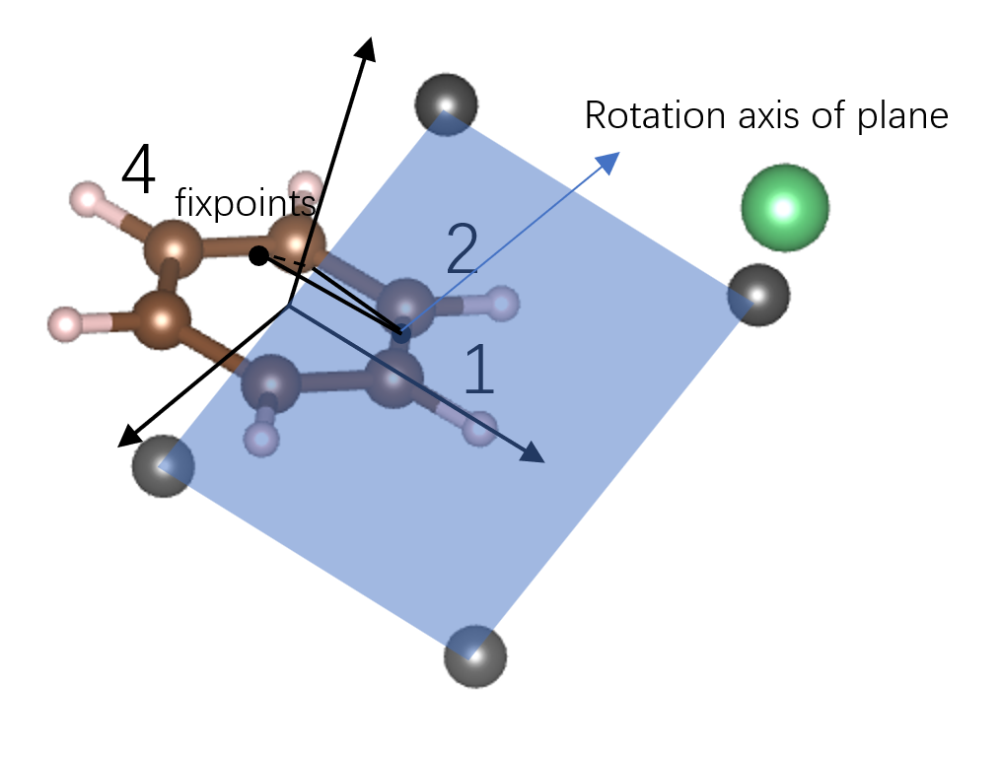
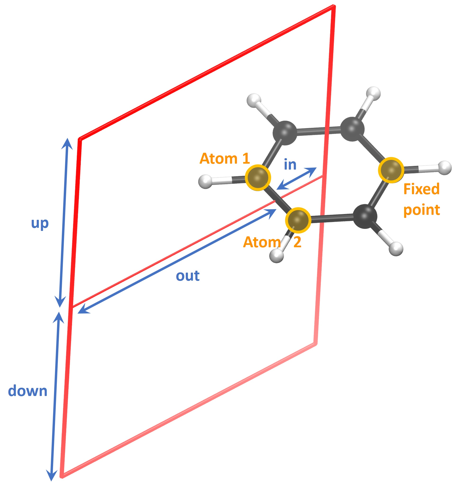

Basic introduction and usage could be found in [Tian Lu's blog](http://sobereva.com/491), or [the document of gimic](https://github.com/qmcurrents/gimic/tree/master/doc)

## Installation
```bash
./setup --omp
cd build
make install
```
If executable file setup runs successfully, then `build` directory will be created. And to restart, `build` should be removed.

And there are some fucking bugs in the python part of source code, in `src/pygimic`, for the `connector.pxd` and `connector.pyx` (the cpython code).

In my point of view, I think maybe it's caused by the same name of the pxd and pyx files, because `connector.pxy` has imported `GimicConnector` function in `connector.pxd`, and `NotAvailable` in `gimic_exceptions.py`. For the former one, I delete the import line in pyx, and for the latter, I write the `NotAvailable` in cython format in pxy:

```python
cdef class NotAvailable(Exception):
    cdef public str backend

    def __cinit__(self, value):
        self.backend = 'GIMIC'
        self.value = value

    def __str__(self):
        return f"Requested method is not available for chosen backend: {self.backend}.{self.value}"

cdef class GimicConnector:
    cpdef jvector(self, r):
        raise NotAvailable('jvector()')

    cpdef jtensor(self, r):
        raise NotAvailable('jtensor()')

    cpdef set_property(self, prop, val):
        pass

if __name__ == '__main__':
    g = GimicConnector()
    g.jvector((0, 0, 0))

# vim:et:ts=4:
```

## Usage

### Gaussian output file

There are two cases: closed shell and open shell. Both of them should add the keyword `Int=NoBasisTransform IOp(10/33=2)` in NMR(GIAO) calculation, for the information transformation from different software (IOp(10/33=2)  to print the perturbed density matrices in the output file).

And two files named `Gaussian2gimic.py` and `BasisSet.py` in `gimic/tools/g092gimic` should be used to generated `XDENS` and `MOL`.

For closed shell, fchk files are needed, then `./Gaussian2gimic.py --input=test.fchk`.

For open shell, log files are needed, so extra keyword `gfprint` should be added in the input file, to print the basis set information, then `./Gaussian2gimic.py --input=test.log`.

And the calculation is proceeded in a cubic box, so the initial orientation of the molecule should be considered, by using `nosymm` keyword.

### cdens calculation

Output files:

`mol.xyz`: the coordinates of the molecule

`grid.xyz`: the coordinates of the molecule, together with eight atoms around the molecule, to form a cubic box

`acid.vti`: the grids data of [acid function](http://sobereva.com/147).

`jmod.vti`: the norm of the current density.

`jvec.vti`: the current density vector.

To export the data to paraView, cml format file should be used instead of xyz format. And the unit of cml should be in Bohr, while `mol.xyz` is in Angstrom. **Then the `mol.xyz` should be converted to Bohr, by multiplying 1.889725989, or divided by 0.5291772109.** The script is as follows, openbabel should be installed first:

```bash
obabel -ixyz mol.xyz -ocml -O mol.cml
awk '{ {FS="\""}; {OFS="\""};
     if ($1 ~ "<atom id") {
         if ($5 ~ "spinMultiplicity")
             { print $1, $2, $3, $4, $5, $6, $7, $8/0.529177, $9, $10/0.529177, $11, $12/0.529177, $13 }
         else if ($5 ~ "hydrogenCount")
             { print $1, $2, $3, $4, $5, $6, $7, $8/0.529177, $9, $10/0.529177, $11, $12/0.529177, $13 }		 
     	 else  { print $1, $2, $3, $4, $5, $6/0.529177, $7, $8/0.529177, $9, $10/0.529177, $11 }
         }
     else print $0; }' mol.cml > mol-bohr.cml

```

### integral calculation

Generate grids perpendicularly to the `bond`/`line`, then fix its orientation, by using `fixpoint`/`fixcoord`, all length should be in Bohr.

1.
`bond = [a, b]` + `distance` + `fixpoint` + `height[-down, up]` + `width[-in, out]`

2.
`coord1` + `coord2` + `distance` + `fixcoord` + `height[-down, up]` + `width[-in, out]`


In integral calculation, `bond` in `Grid` function is used to generate the plane grid. [The ’bond’ type grids define a plane through a bond, or any other defined vector. The plane is orthogonal to the vector defining the bond.](https://github.com/qmcurrents/gimic/blob/master/doc/grids.rst) To fix the orientation of the plane(or it will rotate along the bond), `fixpoint`/`fixcoord` is needed, the line of rectangle should be parallel to the projection of the vector connecting rotation axis of plane and fixpoint onto the plane.

Figure following shows the plane grids under parameters:

```
calc=integral          # cdens, integral
basis="../MOL"
xdens="../XDENS"
openshell=false
magnet=[0,0,1]

Grid(bond) {
    type=gauss                  # Gauss distribution of grid points
    gauss_order=9               # order for gauss quadrature
   bond=[1,2]                  # Use two atoms to define the direction
#   coord1=[-1.21, 0.699, 0.0] # Use two points to define the direction, Bohr
#   coord2=[-1.21, -0.699, 0.0]
    distance=1.32               # Distance of the plane to the first point, Bohr
#   fixpoint=4
   fixcoord=[1.0, 0.0, 1.0]
    grid_points=[30, 30, 0]     # Number of points on grid (i,j,k)
    height=[-5.0, 5.0]    # Grid size of height relative to grid center
    width=[-2.2, 5.0]     # Grid size of width relative to grid center
}

Advanced {
    lip_order=5      # order of Lagrange Interpolating Polynominals to use
    spherical=off     # don't touch, unless you REALLY know what you are doing
    diamag=on           # turn on/off diamagnetic contributions
    paramag=on          # turn on/off paramagnetic contributions
}
```



